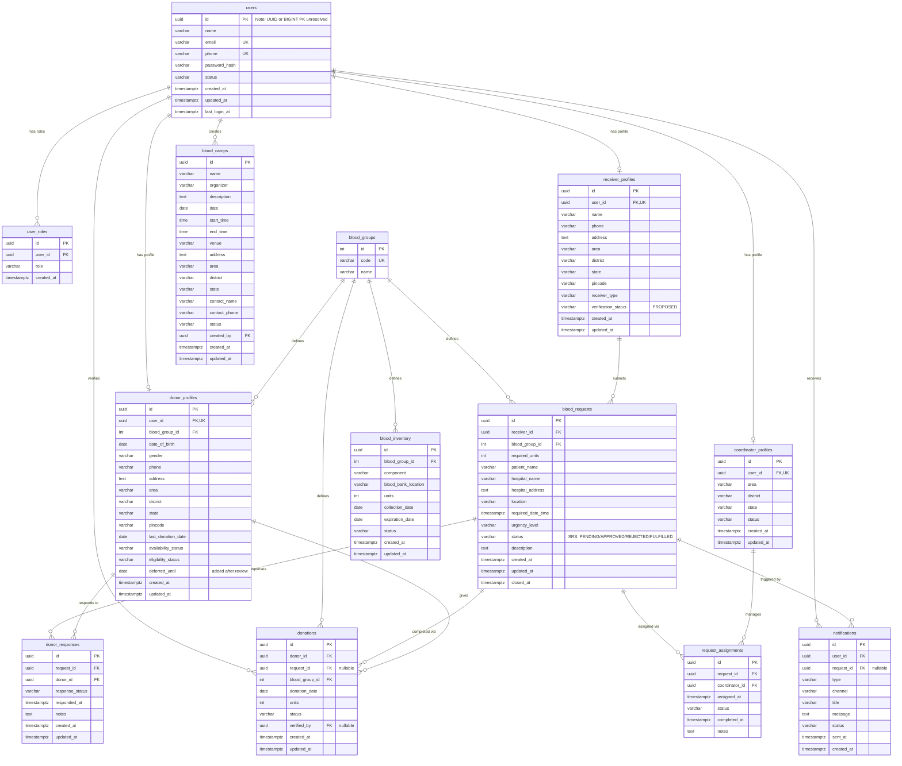

# Gift of Life - Entity Relationship Diagram

This document contains the Entity Relationship (ER) diagram for the Gift of Life blood donation management system database. The diagram is written using Mermaid syntax and matches the database schema exactly.

## Mermaid ER Diagram

## Key Architectural Relationships

1. **Multi-Role Accounts:** `users` is the master identity record. If a person acts as a `DONOR` and a `RECEIVER`, they hold records in both `donor_profiles` and `receiver_profiles` pointing back to the same `users.id` via their respective `user_id` columns.
2. **Normalized Blood Groups:** All blood-type strings are stored inside `blood_groups` and referenced through a Foreign Key. This ensures query consistency and prevents typographical errors in blood types.
3. **Decoupled Responses:** Donor alerts and feedback are separated into `donor_responses` to support matching multiple potential donors to a single request without modifying the `blood_requests` row.
4. **Historical Request Assignments:** Rather than a simple foreign key linking `blood_requests` to a single coordinator, `request_assignments` tracks the full lifecycle of coordinator assignments for auditing purposes.
